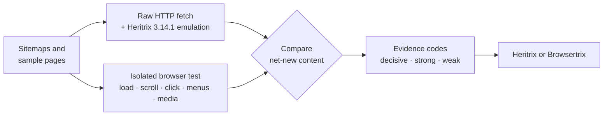

<div align="center">


# Crawler Choice – Heritrix or Browsertrix

**Measure, don't guess: should this website be archived with Heritrix, or does it need a browser-based crawler?**

[](#-requirements)
[](#)
[](#gemini-nano-optional)
[](#-how-it-decides)
[](#-development)

by **Thomas Smedebøl**, Royal Danish Library

[Requirements](#-requirements) · [Install](#-install-in-developer-mode) · [Usage](#-usage) · [How it decides](#-how-it-decides) · [Settings](#%EF%B8%8F-settings) · [Safety](#-safety-and-privacy) · [Development](#-development)

</div>

---

## ✨ What it does

Choosing a crawler for a web-archiving job is often guesswork: *"it looks modern, so it probably needs a browser crawl"*. **Crawler Choice** replaces the guess with measurements.

For a handful of representative pages it compares:

| | |
|---|---|
| 🕷️ **Heritrix side** | what **Heritrix 3.14.1** would discover in the raw HTML (a faithful port of its own link extraction) |
| 🌐 **Browser side** | what a **real browser** loads, shows and fetches when the page is scrolled, clicked, opened and played |

…and recommends **Heritrix** or **Browsertrix**, with every piece of evidence exportable.

> [!NOTE]
> The goal is not to detect "modern JavaScript". The goal is to find out whether a non-rendering crawl can discover and preserve the content, or whether browser execution and interaction are materially required.

---

## 📋 Requirements

> [!IMPORTANT]
> Crawler Choice runs **only in desktop Google Chrome, version 150 or later**. Those are the Chrome versions with built-in **Gemini Nano** and the Prompt API for extensions, and the extension also relies on DevTools-protocol and platform features of the same versions.

| Browser | Supported |
|---|:---:|
| Google Chrome 150+ on Windows, macOS or Linux | ✅ |
| Chrome older than 150 | ❌ *Chrome refuses to install it* |
| Chrome on Android or iOS | ❌ *no extension support* |
| Other Chromium browsers (Edge, Brave, Opera, Vivaldi …) | ❌ *not supported, not tested* |

### Gemini Nano (optional)

The extension can ask Chrome's on-device model for a **second opinion** on borderline cases. It is **off by default**, and the analysis works fully without it. To use it, the computer must meet [Chrome's requirements for built-in AI](https://developer.chrome.com/docs/ai/get-started):

| | Requirement |
|---|---|
| 💻 Operating system | Windows 10/11, macOS 13 (Ventura)+, Linux, or ChromeOS on Chromebook Plus |
| 💾 Storage | at least **22 GB free** on the volume holding the Chrome profile |
| ⚙️ Hardware | GPU with **more than 4 GB VRAM**, *or* **16 GB RAM** and **4+ CPU cores** |
| 📶 Network | unmetered connection for the one-time model download |

After the download the model runs locally, and no data leaves the computer.

---

## 🚀 Install in developer mode

The extension is not in the Chrome Web Store; it is loaded as an **unpacked** extension.

1. **Get the code.** Clone the repository, or download the release zip and unzip it.
   ```bash
   git clone <repository-url>
   ```
   You need the folder that contains `manifest.json`, not the zip file itself.
2. **Open** `chrome://extensions` in the address bar.
3. **Turn on Developer mode** with the switch in the top-right corner.
4. Click **Load unpacked** and select the folder that contains `manifest.json`.
5. **Allow Incognito access (required).** Click **Details** on the Crawler Choice card and switch on **Allow in Incognito**.
6. **Pin it.** Click the 🧩 puzzle-piece icon in the toolbar and pin **Crawler Choice**.
7. *(Optional)* Tick **Gemini Nano second opinion** in the popup. If the model isn't downloaded yet, the popup shows **Download model**.

> [!WARNING]
> Step 5 is required. Every test runs in fresh, isolated Incognito windows, so the extension won't start an analysis without Incognito access.

<details>
<summary><b>Updating to a new version</b></summary>

Replace the folder's contents with the new version and click the **↻ reload** arrow on the extension's card in `chrome://extensions`. Your settings are kept.

</details>

<details>
<summary><b>Managed (company / institution) computers</b></summary>

If your organisation's Chrome policies block developer mode, or disable the developer tools that the extension's request guard depends on, the extension can't be installed or can't run tests. Ask your IT department.

</details>

---

## 🧭 Usage

1. Open the website in a **normal** (not Incognito) window.
2. Click the **Crawler Choice** icon, check the settings, and press **Analyze site** (or **Analyze page**).
3. Test windows open and close by themselves. **Cancel** stops a run at any time.
4. Read the recommendation and short report, and export what you need.

> [!TIP]
> While tests run, Chrome shows a bar saying *"Crawler Choice started debugging this browser"*. That bar is expected: it belongs to the request guard that keeps the tests read-only.

A whole-site run takes from about 30 seconds to a few minutes (the default cap is 6 minutes).

### What you get

**The recommendation:** Heritrix or Browsertrix, with a confidence level and the rule that decided it.

**The short report**, which opens with an easy comparison of what each crawler would find:

```text
Recommendation: Browsertrix (HF confidence: high; rule: decisive-measured-signal).
• Unique same-site URLs found (10 samples tested both ways): browser 347 · Heritrix 404 → ~319 real after removing estimated fictive URLs (range 307–332) (+28 for the browser)
• Of these: 88 found by both · 259 only by the browser (2 page links, 40 srcset) · 316 only by Heritrix = 186 from HTML attributes + 130 speculative; URL check of 60 speculative: 38 fictive, 20 live, 2 unknown → ~66 % fictive.
• Scrolling loads new internal links via data requests that are not in the raw HTML. [SCROLL_DISCOVERS_LINKS; 4/10 samples]
```

**Exports**

| Export | Contents |
|---|---|
| 📄 **Evidence JSON** | every measurement behind the decision, per sample; also works as a regression fixture |
| 🧰 **Browsertrix config** | YAML hints: seeds, scope, behaviors, `clickSelector`, timeouts, custom-behavior hints |
| 🌱 **Heritrix seeds** | start URL, discovered sitemaps, and the data (XHR/fetch) hosts seen in the tests as seeds for scoping (third-party hosts commented out) |

The popup also lists the sample pages, the discovered sitemaps and the URLs used in the URL check.

---

## 🔬 How it decides



1. **Sitemaps and samples.** The extension discovers the site's sitemaps and picks a small, deterministic set of representative pages: front page, listings, sections, detail pages, interactive pages, and always one page from each of the two most common sitemap URL patterns.
2. **Heritrix side.** Each sample is fetched as plain HTTP and its links are extracted with a port of **Heritrix 3.14.1's own link extraction** (`ExtractorHTML` + inline `ExtractorJS`/`ExtractorCSS`). It reproduces Heritrix's regexes, base-URL handling, heuristics and quirks, and is checked against Heritrix's own unit tests.
3. **Browser side.** Each sample is measured in phases: load, idle baseline, scrolling, controlled clicks (load more, pagination, tabs, accordions), burger and dropdown menus, media playback, page-flip viewers, and Browsertrix-style srcset fetching. Only **net-new** content counts, and the idle baseline is subtracted so ads and carousels don't fake a signal.
4. **Decision.** Differences become evidence codes. **Decisive** evidence, e.g. scrolling that loads new links via data requests, selects Browsertrix. Otherwise the decision is conservative: Heritrix unless several strong signals agree.

> [!TIP]
> The **Guide** button in the popup opens the full method: every evidence code, threshold and limitation.

---

## ⚙️ Settings

| Setting | Default | What it does |
|---|:---:|---|
| Test scope | Whole site | *Whole site*: sitemaps and samples. *Active tab URL only*: just this page. |
| Samples | 7 | 5–20 pages for a whole-site run. |
| Consent banners | Leave untouched | Optionally *Try "reject all"* or *Try "accept all" + hide leftovers*. Tuned for Danish and European consent platforms (Cookiebot, Cookie Information, OneTrust, Usercentrics, Didomi, Sourcepoint …). |
| Test windows | Unfocused, visible | *Minimized* is less intrusive, but Chrome slows hidden pages, so dynamic loading may be missed. |
| Max run time | 6 min | Hard limit for the whole run (2–20 minutes). |
| Respect robots.txt Disallow | off | Leaves disallowed URLs out (legal-deposit crawls usually ignore robots.txt). |
| Gemini Nano second opinion | off | Can confirm or veto *non-decisive* evidence; never overrides decisive signals. |
| Stop at decisive evidence | on | Ends a whole-site run as soon as decisive evidence is found. |
| Check Heritrix's speculative URLs | on | Checks up to 60 URLs that only Heritrix's heuristics found (polite HEAD requests) to estimate how many are fictive. |

---

## 🔒 Safety and privacy

- **Isolation.** Every run uses fresh Incognito windows. No cookies, logins or history from your normal browsing are used, and Incognito downloads are cancelled.
- **Read-only browsing.** A DevTools-level request guard blocks every non-GET request from the test pages (no form posts, logins or purchases), and navigation away from the site is blocked before it is sent.
- **Careful clicking.** Only controls without a link target are clicked, and anything with risky wording (log in, buy, subscribe, delete …) is skipped.
- **Polite fetching.** At most 3 requests at a time per host, with pauses, and slowing down on 429/503 answers. The URL check uses HEAD requests, never with cookies.
- **On-device AI only.** Gemini Nano receives only numbers and fixed codes, never page text or URLs, so a page can't inject instructions into it.
- **No data leaves your computer** other than the requests to the site being analysed.

---

## ⚠️ Limitations

- **Desktop layout only.** Menus or content that exist only in a mobile layout are not tested.
- **First page only on the raw side.** The comparison uses each page's own HTML. URLs Heritrix would find later, in fetched CSS/JS files, aren't modelled.
- **Approximate URL normalisation.** The Heritrix emulation follows the Heritrix source closely, but URL normalisation is approximated.
- **A guide, not a guarantee.** The result is based on a sample of pages; very heterogeneous sites may need a closer look.

---

## 🛠 Development

No runtime dependencies and no build step: the folder you load **is** the source.

```bash
npm test   # Node.js built-in test runner (Node 20+, developed with Node 22)
```

The tests cover sample selection, the Heritrix emulation (including Heritrix 3.14.1's own `ExtractorHTMLTest`, `ExtractorJSTest` and `ExtractorCSSTest` cases), scoring, consent handling, the URL check and the exports.

<details>
<summary><b>Project layout</b></summary>

```text
manifest.json         MV3 manifest (Chrome 150+)
background.js         service worker: run orchestration, test windows, scoring, report
popup.html/.js/.css   the popup
guide.html/.css/.js   the user guide (opened from the popup)
offscreen.html/.js    raw-HTML analysis and the Gemini Nano fallback
probe/injected.js     measurement probe (snapshots, scroll, clicks, menus, media, viewers, srcset)
probe/consent.js      consent-banner handler (all frames)
lib/                  pure modules: heritrix-extractor, raw-basis, samples, sitemaps, scoring,
                      url-comparison, url-check, cdp (request guard), consent-guard, export, psl …
tests/                node:test suites
```

</details>

📜 See [CHANGELOG.md](CHANGELOG.md) for the version history.

---

## 🙏 Acknowledgements

- **[Heritrix](https://github.com/internetarchive/heritrix3) 3.14.1** and **[webarchive-commons](https://github.com/iipc/webarchive-commons) 3.0.3** (Apache License 2.0). `lib/heritrix-extractor.js` is a JavaScript port of their link-extraction code, and `lib/heritrix-data.js` is generated from their sources.
- **[Public Suffix List](https://publicsuffix.org/)** (Mozilla Public License 2.0), used to decide what counts as "the same site".
- **[browsertrix-behaviors](https://github.com/webrecorder/browsertrix-behaviors)** (Webrecorder). The browser-side srcset collection mirrors its `autofetcher`.
- **I don't care about cookies**, **[Consent-O-Matic](https://github.com/cavi-au/Consent-O-Matic)** (Aarhus University) and **[DuckDuckGo autoconsent](https://github.com/duckduckgo/autoconsent)** inspired the consent-banner method. No rules or code from those projects are included.
